# 杂记

1、loading即支持组件的写法，又支持api调用的写法，不过优先api的调用，方便很多

2、loading、toast的基准zIndex都是1000，单例模式，后执行会覆盖前面执行

# 字体大小
常规 16px
小点 14px

# bug日记
## 1、做dialog渐变的时候，头部区域总是被遮住，解决把整个dialog的zIndex设高点，比header高就可以
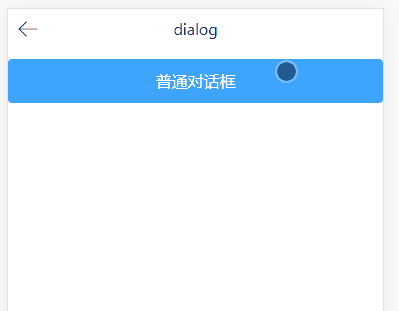

## 2、actionSheet中，销毁组件的时候要移除dom
```js
destroyed () {
    document.body.removeChild(this.$el);
}
```

这种写法如果是插件形式调用就没有问题，如果是组件调用，在移除的时候就会报错如下

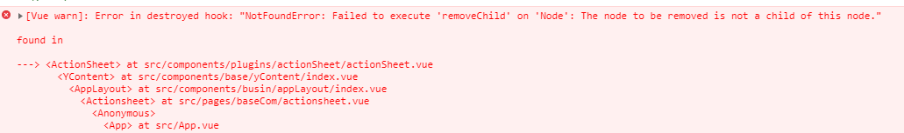

原因是组件的写法，往往组件最后生成的不直接在document.body里面，可能隔着好几层div，所以执行`document.body.removeChild`自然找不到这个DOM。换成下面写法就可以保证找得到
```js
this.$el.parentNode.removeChild(this.$el);
```

## 3、modal目前只是用于展示类，如果里面有表单等元素，涉及数据交互，如何把modal传递到该页面上
暂时还没想好怎么处理

## 4、transform对inline元素无效，像span这种

## 5、对于icon，如果要做rotate，多少有点儿偏差，还是用图片来比较好
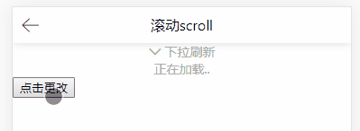

明明已经设置了``transform-origin: center center;`，但还是看出明显不是绕中间点旋转，原因是用字体图片实现的，图标和`<i>`多少有点出入
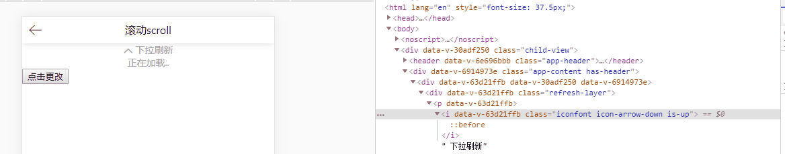

## 6、在做下拉加载中，顶部文案一开始用过滤器
```html
<div class="refresh-layer flex justify-center align-center">
    <i class="arrow-down" :class="{'is-up': state == 1}"></i>
    <span>{{state | mapDate({
        0: '下拉刷新',
        1: '释放刷新',
        2: '正在加载..'
    })}}</span>
</div>
```
会发现这种写法，下拉移动过程中，疯狂的调用过滤器函数，实际上资源有写浪费，所以好的做法是根据父级class是否`is-up`这个来控制里面的display。最后改成代码中的


## 7、transition-duration单位不能省，不让不起效果
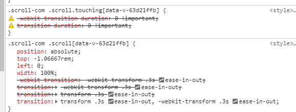

像上面`transition-duration:0`不起效，应该写成`transition-duration:0s`


## 8、如何简单实现手指越滑动，div移动越少但还是有滑动
以前一直研究是乘以某个系数，今天发现更简单的方法`Math.pow(diff, 0.8)`
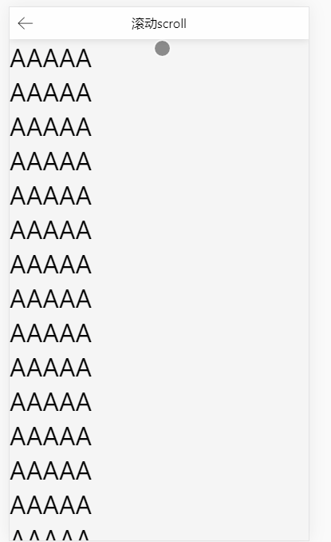

## 9、关于scroll监听应该加在谁的问题
对于click、touchstart、touchend等事件，由于习惯了谁触发加在谁身上的思维，对于scroll监听一开始也是这么做
```html
<div class="box" id="box">
    <div class="inner" id="inner" @scroll="scrollHandle">
        <h1>111</h1>
        <h1>111</h1>
    </div>
</div>
```
但实际上scroll监听应该加在父级上的
```js
<div class="box" id="box">
    <div class="inner" id="inner">
        <h1>111</h1>
        <h1>111</h1>
    </div>
</div>
  
// 原生js
let oBox = document.getElementById('box');
let oInner = document.getElementById('inner');

oBox.addEventListener('scroll', function () {
    console.log('box-scroll'); // 真正触发的是这里
}, false);
oInner.addEventListener('scroll', function () {
    console.log('box-scroll');
}, false);
```


## 10、上拉无限加载，当出现暂无数据又该如何处理
暂时先由外面调用第二个参数，组件内改变状态


## 11、组件内嵌组件，css又要影响内组件
在actionSheet.vue，外面可以引入actionSheetItem.vue作为内组件插入slot，一开始发现actionSheet.vue的li样式无法传递给actionSheetItem.vue进去。解决方法，给li加`/deep/`即可


## 12、单选
单选$emit给外界的一开始是数组的下标，后面考虑如果是反显后台接口功能，后台接口关注返回的是code，所以又把组件的$emit改为广播code参数

复杂单选使用yRadioItem组件，除了唯一标识:value是传递yRadioItem的，其他参数最好都是给yRadio，yRadioItem里面也竟可能的通过调用this.$parent的属性和方法去实现功能。一来不论简单单选还是复杂单选，都比较统一参数传递，二来功能也容易统一和排查bug。另外yRadioItem里面必然涉及到选中未选中className的判断，目前参考vux的checker组件，由computed实现

单选-选择同一个，一开始没有做取消动作，后面考虑如果那一栏是非必填用户又不小心选中了，那么就取消不了了，所以后面又改为如果选中同一个，做取消动作

## 13、多选
多选-后台接口反显，关于$emit应该是什么一直都在犹豫，目前v-model是数组的下标索引，出发点是觉得方便外界根据索引下标拿到对应的字典项，至于根据接口反显，接口更多应该是一个`['YG001', 'YG002']`这种类型的，那么v-model是索引下标又显得不合适了。二来做选中未选中状态那里，要根据判断是否在数组中来实现，又显得没有直接给list每个元素加isSelected来的方便

## 14、开关
~~一开始toggle是直接用v-model来实现关闭开启状态，后面考虑这种业务场景：点击要关闭的时候，先请求后台接口成功后才真正做出关闭动作，又改为属性:isOpen来标识是否开启，同时$emit出外界将要改变为状态的boolean，又外界自己去控制~~

后面做了兼容，要请求后台的使用`:value + @input`来组合实现，和后台无关的用`v-model`来实现，即支持v-model又支持value

## 15、多个toast
~~连续多个toast的时候，后者内容会覆盖前者的，回调promise.resolve只执行最后一个，这样子感觉又不太合适~~

改成每次show都会new实例，并且存在一个队列里面，连续多个toast也可以展示并且调用各自的回调，后面的会让前面的toast提前消失并且回到函数。

代价：每次toast都是new出来，性能降级

## 16、所有appendTo(body)的bug

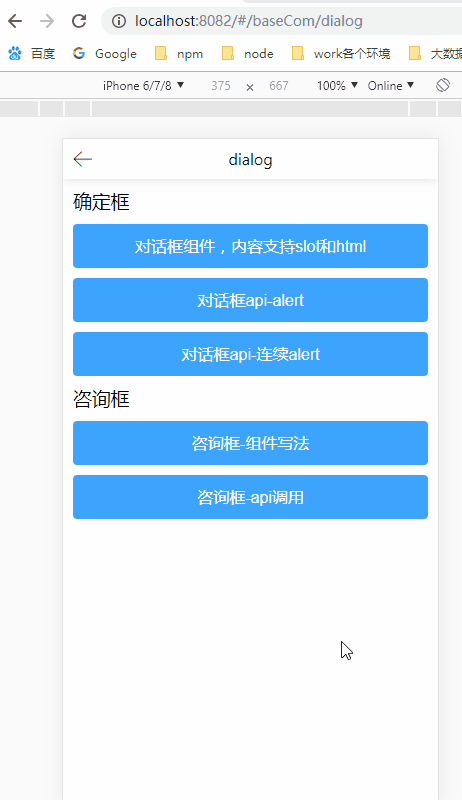

由于添加是调用`appendTo(body)`，所以出现弹窗后，如果用户按了安卓返回键，那么就会造成截图的现象。页面返回了但是弹窗依旧存在

* voinic、vant框架也存在这样的问题
* vux用beforeEach解决，beforeEach里面`Vue.$vux[one].hide && Vue.$vux[one].hide()`
* cube-ui的解决方式：在组件中调用`this.$alert`，那么这个`this`指向的是页面`div.child-view`，当页面消失的时候，会触发`beforeDestroy`，最主要的是，在使用`Vue.prototype.$alert = () => {}`不能用箭头，用普通的函数，这样里面的`this`就会指向具体的调用页面组件，这样子只要监听`hook:beforeDestroy`就可以了。

~~这里用的是vux的方法，并且加上改动，这样子如果是按了物理返回键，则消失弹窗，再则后退：所有浮层类弹窗实例化后存在`Vue.$yui`下面，然后再beforeEach判断下是否有值，有值则`next(false)`，无值则`next()`~~

上面划掉线的方式有一种弊端，对于插件式的调用是没有问题了，但是我们为了应对那些复杂的，除了支持插件式很支持组件式，但用了组件式的话，上面的就行不通了，现在改为在组件内做上面划线的动作

这类组件有：dialog、。loading不做这种处理不然还要考虑取消ajax的情况

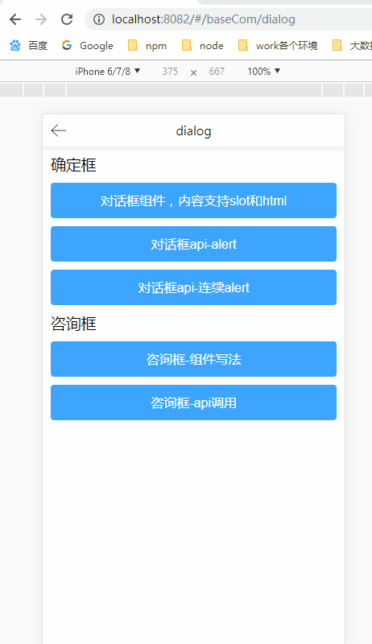

## 17、单例模式
对于一些组件，比如dialog 等，原则上1个页面上只能有1个

目前单例的组件有toast、dialog、actionsheet、modal

loading也要改为单例模式

modal不是单例，因为有这么的场景，点击一个modal里面的按钮，又出现一个新的modal

有时候真的不能按下后退键就触发消失

## 18、svg转字体文件
以前是在[Icfont](https://www.iconfont.cn/)转化的，往往开发到后面，可能出现新的图标需要添加，那么重新上传到icfont然后再来一遍非常费时，所以这里借用工具[svgtofont](https://cloud.tencent.com/developer/article/1343953)来转化

发现有的图标出现错位现象，经过排查，发现是要每个svg的大小不一样，转化的时候应该统一下
```
svgicons2svgfont: {
    normalize: true // 要加这个，不然字体会变形，缩放icon使的最适应最大的icon
}
```


## 19、组件、vue.use、自己导入都支持
目前actionSheet的写法，这三种引用方式都支持，倒是原则上不应该有这么多种，比如actionSheet不可能每个页面都有，那么就不应该支持Vue.use，应为会在首页把资源加入了

## 20、单例模式的弊端
比如actionSheet中，使用的是单例默认，页面刷新的时候已经实例化好了，那么就存在一个问题

第一个actionSheet传入了标题title、列表list

第二个actionSheet传入了列表list33

当先出现第一个actionSheet，后出现第二个actionSheet的时候，由于第1个执行show的时候，会把title赋值给实例了，当到了第二个actionSheet，那个title依旧存在


vux的解决方法: 在Object.assign之前，先取得props的默认值存在来
```
const defaults = {}
  for (let i in $vm.$options.props) {
    if (i !== 'value') {
      defaults[i] = $vm.$options.props[i].default
    }
  }
```

## 21、picker
在做picker的时候，做了中间一根横线`.y-picker-hairline`，然后给.pk-column做了touch事件监听，但是当手指一开始就放在`.y-picker-hairline`的时候，就触动不了，即下面的现象
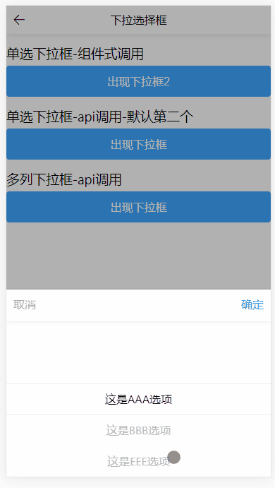

后面看了vant的源码，发现是用css控制，给`.y-picker-hairline`加上css`pointer-events: none;`这样子就不再响应鼠标事件了 

[资料](https://developer.mozilla.org/zh-CN/docs/Web/CSS/pointer-events)

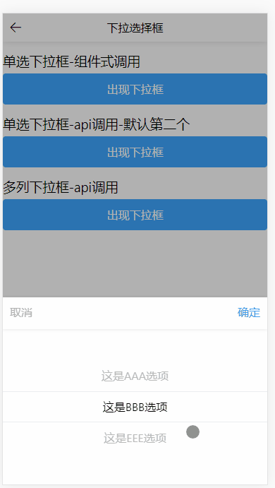

picker感觉不适合做成单例模式，因为单例模式，每次在show()方法中，需要对配置进行默认初始化，这样子造成了，用户选择完，下载又恢复到最开始的状态，如下

gif图的仅仅是初始化默认值的问题(这个可以通过设置默认值value，每次修改后去改变)，但是还有很多其他的问题，比如说改变第1栏后第2栏内容也变了

picker使用组件引用(比如vant)，如果是插件的话，就不要单例了(比如vux)

还要考虑弹窗有时候真的不想返回键消失

## 22、reject浏览器报错
由于picker、actionSheet等，点击遮罩层会关闭浮层，并执行promose.reject，如果外面不对其做处理会报错如下

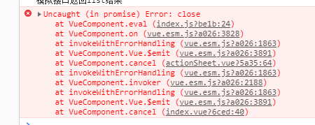

加上下面代码可以解决
```
// Promise Catch不报错
window.addEventListener('unhandledrejection', event => event.preventDefault());
```

#### 严重的问题bug
bug重现：picker.js是插件代码，里面实现picker.vue，picker.vue里面引入popup.vue，

picker.js代码如下
```js
import Vue from 'vue';
import pickerCom from './picker';

class PickerClass {
    show (options) {
        this.PickerConstruction = Vue.extend(pickerCom);
        this.vm = new this.PickerConstruction().$mount(document.createElement('div'));
        document.body.appendChild(this.vm.$el);
        this.vm.isShow = true;
        Vue.nextTick(() => {
            console.log('1', this.vm.$el);
        });
        console.log('2', this.vm.$el);

        setTimeout(() => {
            console.log('3', this.vm.$el);
        }, 2000);
    }
}

export default PickerClass;
```

picker.vue代码如下
```html
<template>
    <y-popup :isShow.sync="isShow" @cancel="cancel"></y-popup>
</template>
```

popup.vue代码如下
```html
<template>
    <transition name="fade">
        <div class="y-popup-com" v-if="isShow">sdfsdf</div>
    </transition>
</template>
```
当调用show方法，DOM已经被添加入body里面了，然而`this.vm.$el`获取到的依旧是`<!---->`，这个问题只存在组件里面又含有组件，并且子组件外层用`transition`包含的时候才会

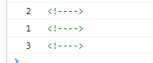


## 杂记
### 1、
```js
let DialogConstructor = Vue.extend(dialogCom);
// new DialogConstructor会触发created钩子 加上el触发mounted钩子
this.vm = new DialogConstructor({ el: document.createElement('div') });
```
第2句等同于
```js
this.vm = new DialogConstructor().$mount(document.createElement('div'));
```
